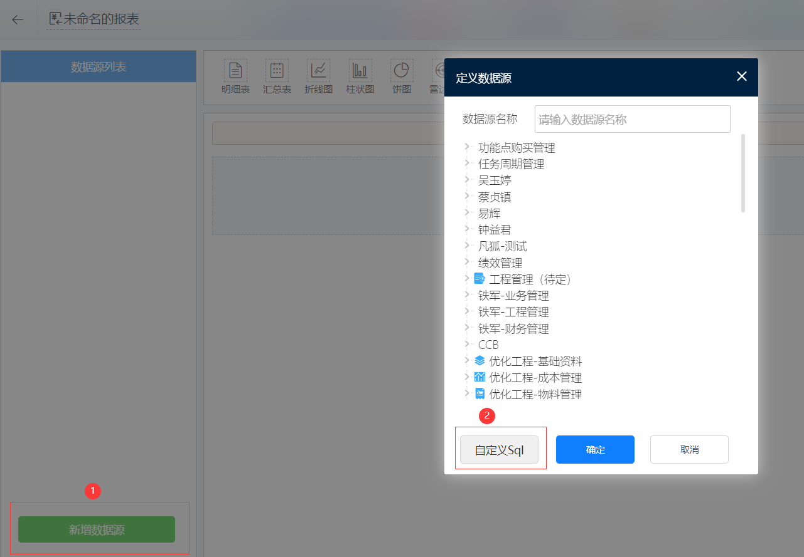

# SQL报表/SQL高级数据源

氚云可以通过编写SQL语句查询数据，并展示到报表中，且提供了两种方式：SQL报表、SQL数据源。

如果需要测试 ```SELECT``` 语句，也可以通过这两种方式进行测试。

!> 注意：SQL报表、SQL高级数据源 只能执行 ```SELECT``` 语句，不支持执行这些语句： ```DDL```（如：CREATE TABLE）、```DML```（如：INSERT/UPDATE/DELETE）、```DCL```（如：COMMIT/ROLLBACK）、```TCL```（如：事务）。

## SQL报表

SQL报表已处于下架计划中（具体下架时间待定），下架完成后，对下架前的报表无影响，但是无法新增报表。所以，尽量去使用SQL高级数据源+仪表盘的方式实现需求。

考虑到目前SQL高级数据源还不支持动态传参，所以导致有些需求通过SQL高级数据源无法实现，而通过SQL报表可以实现，所以这里依然对SQL报表使用方式进行说明。

### 使用路径

* 第一步：新增一个报表：


* 第二步：新增数据源，并选择“自定义Sql”：
